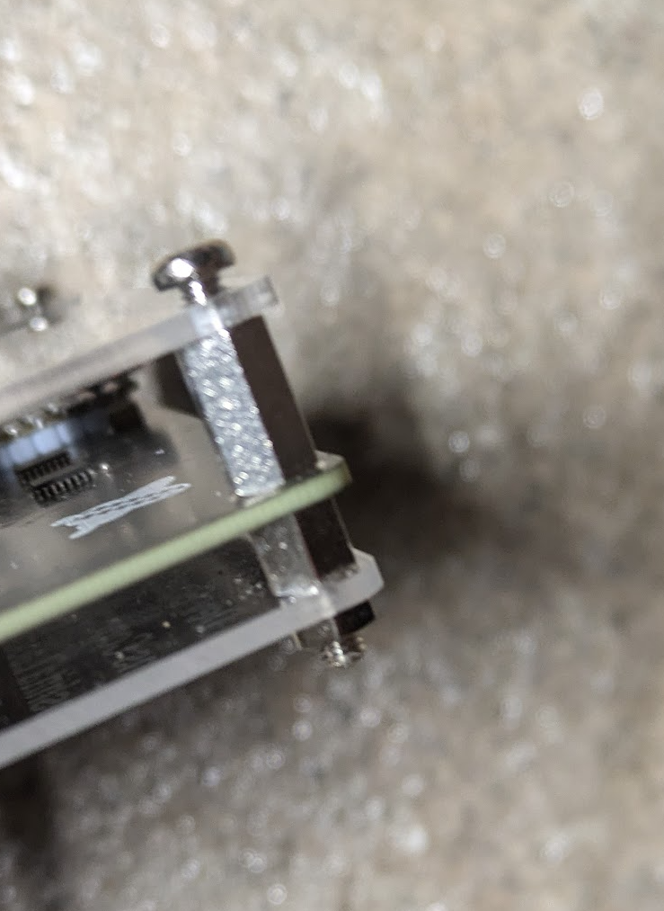

# Traktor Stems用マイコン付属！ MIDIコントローラ開発キットさん

## キットに含まれるもの

- 部品実装済み基板
- マイコン Seeeduino XIAO RP2040(サンプル書き込み済み)
- ピンソケット 1x7 2個
- ピンヘッダ 1x7 2個
- ノブ 24個
- タクトスイッチキャップ 24個
- ナット 6個
- 六角オネジ・メネジM3 10mm(長い方) 6個
- 六角オネジ・メネジM3 5mm(長い方)  6個
- なべ小ねじ m3l  6個
- ゴム足 4個
- 底用アクリル板
- 上用アクリル板

## 組み立て方

1. ピンソケット、ピンヘッダ、マイコンをはんだづけします。
2. 1で組みたてたものを基板にはんだづけします。
3. 底用アクリル板、基板、上用アクリル板を組みたてます。
ナット、六角オネジ・メネジ、小ねじはこのような順番です。
  
4. ノブをとりつけます。
5. タクトスイッチキャップをとりつけます。
6. ゴム足をはりつけます。

## 使い方

<https://github.com/kinoshita-lab/StemsMIDI/tree/main/Traktor%20Setting> にある.tsiファイルをTraktorにインポートしてご利用ください。
