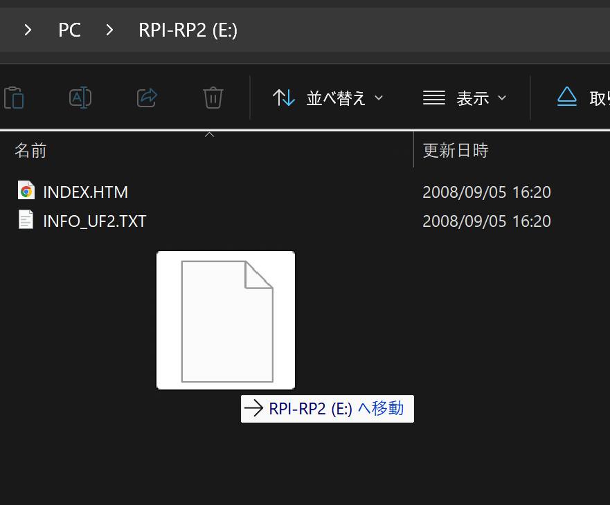

# STEMS MIDI Traktor Stems用MIDIコントローラ (開発キット)

## ChangeLog

### ソフトウェア
releases(https://github.com/kinoshita-lab/StemsMIDI/releases)

### ハードウェア Rev. 1.1
- Filter 意外はセンタークリックではなくなりました
- 基板に検査用端子が追加されました

## キットに含まれるもの

- 部品実装済み基板
- マイコン Seeeduino XIAO RP2040(サンプル書き込み済み)
- ピンソケット 1x7 2個
- ピンヘッダ 1x7 2個
- ノブ 24個
- タクトスイッチキャップ(半透明) 24個
- ナット 6個
- 六角オネジ・メネジM3 10mm(長い方) 6個
- 六角オネジ・メネジM3 7mm(短かい方)  6個
- なべ小ねじ M3 6個
- ゴム足 4個
- 底用アクリル板
- 上用アクリル板

## 必要な工具

- はんだごて、はんだ
- +ドライバー(No.2)
- ラジオペンチ、もしくはM3のナットが締められるレンチなど

## 組み立て方

### マイコンの組みたて

ピンなどがズレないように、下記の方法でのはんだづけを推奨します。
tips: ピンソケットを使わず、マイコンとピンヘッダを直接基板にはんだづけすることも可能です。用途に応じて、最初の手順を省いてください。

ピンソケット、ピンヘッダ、マイコンをはんだづけします。 まず、ピンソケットとピンヘッダを、下図のように組み合わせます。

組み合わせたものをマイコン左右の穴に挿入し、下図のように取りつけます。

基板の図の位置の穴に挿入します。

この状態で、マイコンのピンをはんだづけします。

このような状態になります。

再度、基板の図の位置の穴に挿入します。

マイコンを押さえながら裏返しにし、机との間にノブを挟むなどして、自重で固定できるようにしながら裏返します。下図のようになります。

ピンソケット(またはピンヘッダ)の足を全てはんだづけします。

### ケースの組みたて

底用アクリル板の保護シートをはがし、6カ所に、ナット、六角オネジ・メネジM3 7mm(短い方)をとりつけます。アクリルに裏表はありません。

基板を上に載せ、六角オネジ・メネジM3 10mm(長い方)を取りつけます。全体の位置を合わせながら、各ネジを少しずつ締めていきます。

上用アクリル板を載せ、なべ小ねじで締めます。全体の位置を合わせながら、各ネジを少しずつ締めていきます。

底面にゴム足を貼りつけます。

ノブを取りつけます。

タクトスイッチキャップを取りつけます。

## 使い方

組みたてたものをPCに接続します。

<https://github.com/kinoshita-lab/StemsMIDI/tree/main/Traktor%20Setting> にある.tsiファイルをTraktorにインポートしてご利用ください。

## ソフトウェアのアップデート方法

必要なもの:

- <https://github.com/kinoshita-lab/StemsMIDI/releases> からダウンロードした、最新の firmware.uf2 ファイル
- PC または mac

マイコンの右下にある、 **B** ボタンを押しながらUSBケーブルを接続してください。
  

ボタンを離すと、ディスクドライブがPCかmac上に表示されます。ドライブ名は `RP-RP2` です。

firmware.uf2をディスクドライブにコピーします。

アップデートは以上で完了です。ドライブの表示は自動的に閉じます。
