# STEMS MIDI: MIDI Controller for Traktor Stems (Dev board)

[日本語はこちら(Document in Japanese)](./README.ja.md)

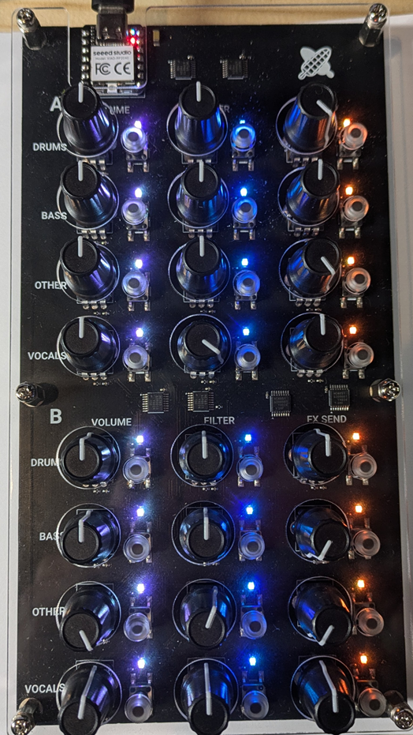
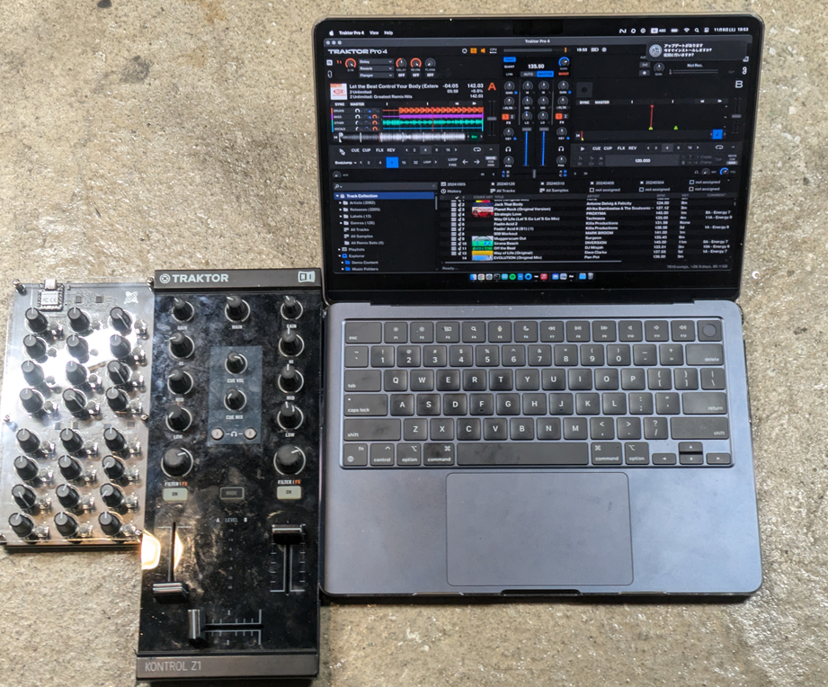

## ChangeLog

### Rev. 1.1

- [Hardware] Remove center-click feature for Vol and Effect knobs
- [Hardware] Add testing terminals on PCB
- [Software] Add Information shown when connectiong to PC

## Kit Contents

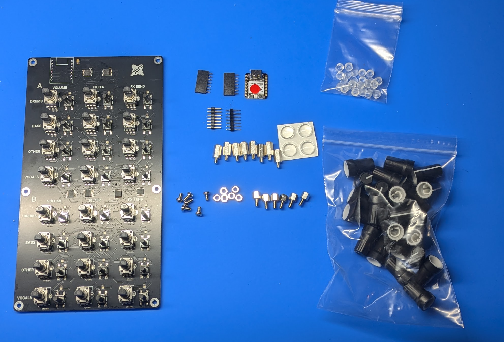

- Pre-assembled PCB
- MCU Module Seeeduino XIAO RP2040(with flashed "sample" program)
- Pin Socket 1x7 (2 pcs.)
- Pin Header 1x7 (2 pcs.)
- Knob Caps (24 pcs.)
- Tactile switch Caps (24 pcs.)
- M3 Nuts (6 pcs.)
- M3 10mm Hex Spacers (6 pcs.)
- M3 7mm Hex Spacers (6 pcs.)
- M3 Screws (6 pcs.)
- Rubber feet pads(4 pcs.)
- Bottom Acrylic Panel (1 pcs.)
- Top Acrylic Panel (1 pcs.)

## Requied Equipments

- Solder Iron, Solder
- No.2 + Driver
- Plier and/or Wrench (for tightening nuts)

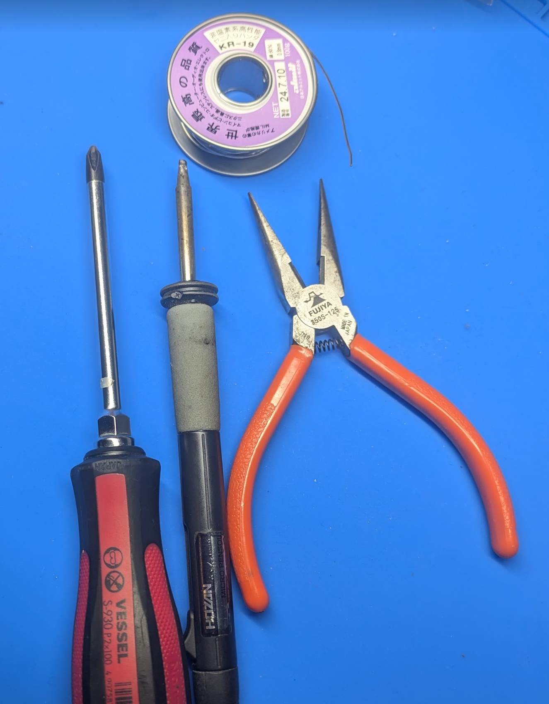

## How to assemble

### Assemble the MCU Module

Recommend following procedure to align pins.
tips: You can solder MCU Module directly on the PCBA board.

Solder Pin Sockets, Pin Headers, and MCU. 1st, combine Pin Sockets and Headers as show below:

Put above result into MCU's both side holes as shown below:

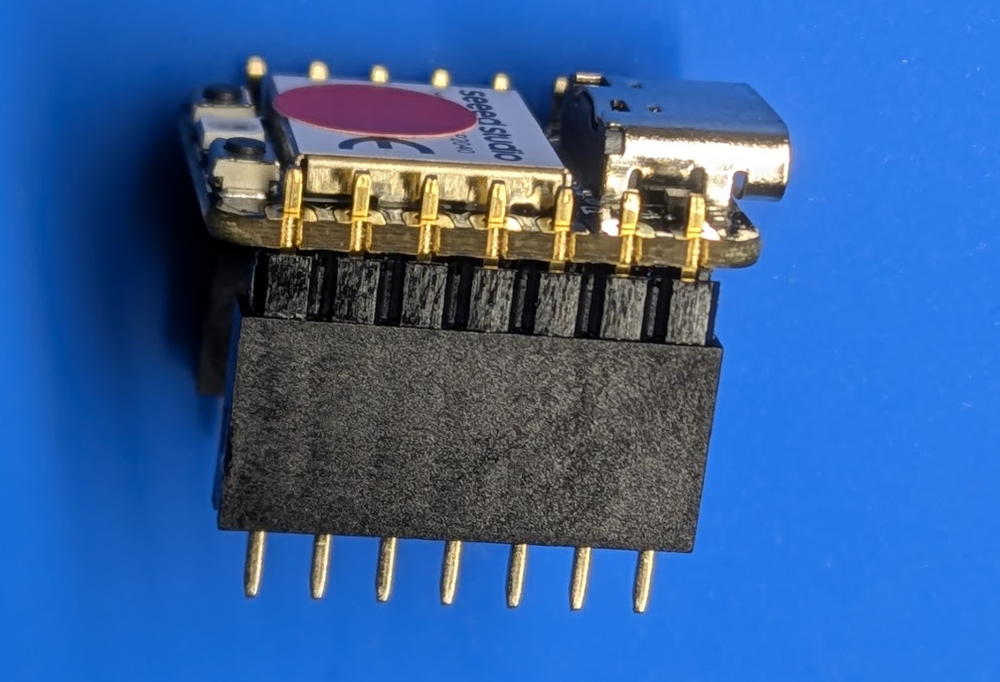

Put them on the holes of PCBA below:

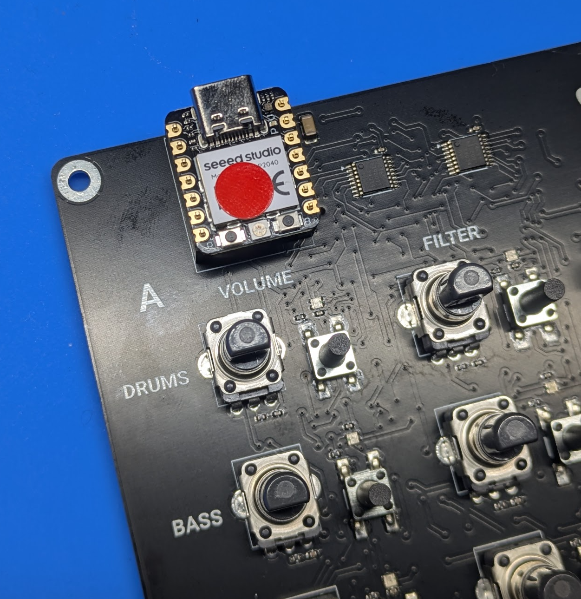

Solder the Pin Header's MCU side:

Looks like below:

Put it again on the PCBA's holes:

Flip the PCBA board while holding the MCU module, with placing knob cap between MCU and the desk so that it can be held in place by its own weight.

Looks like below:

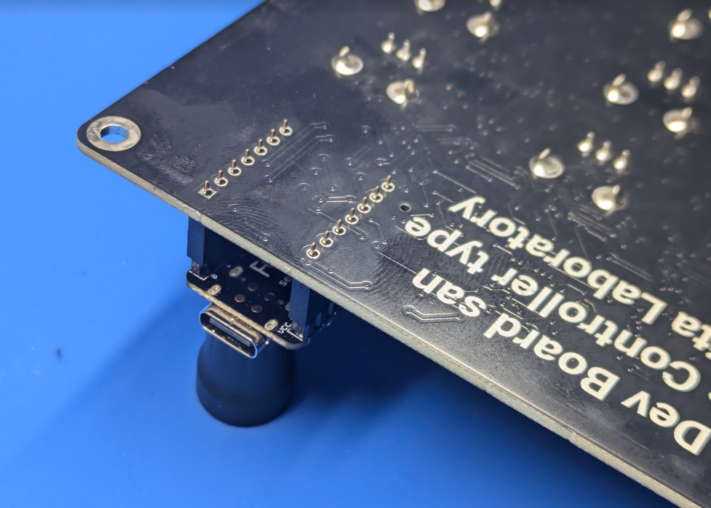

Solder all the Pin socket's pin:

### Assembling case

Peel off the protective sheet from the bottom acrylic panel, and attach nuts, M3  7mm Hex spacers hex screws (the shorter ones) at six locations.
(There are no two sides to the acrylic.):

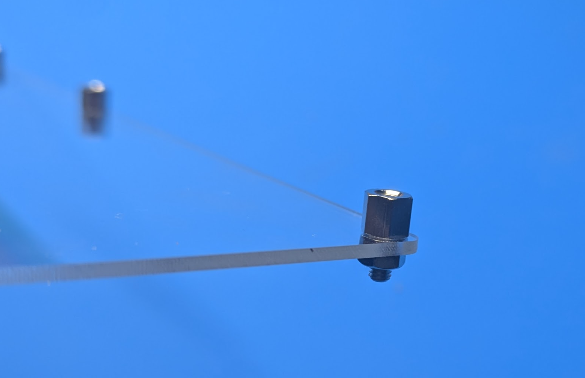

Put PCBA bord on it, tighten with the M3 10mm hex screws (the longer ones).
Tighten each screw little by little at to align the overall position:

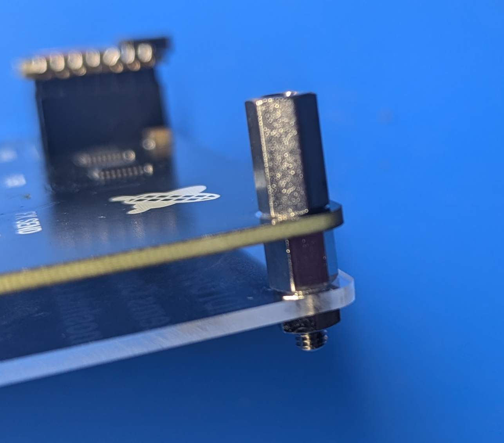

Peel of the protective sheet from top acrylic panel and put it on the PCBA.
Tighten them with M3 screws.
Again, tighten each screw little by little at to align the overall position:

Put rubber feets on the bottom:

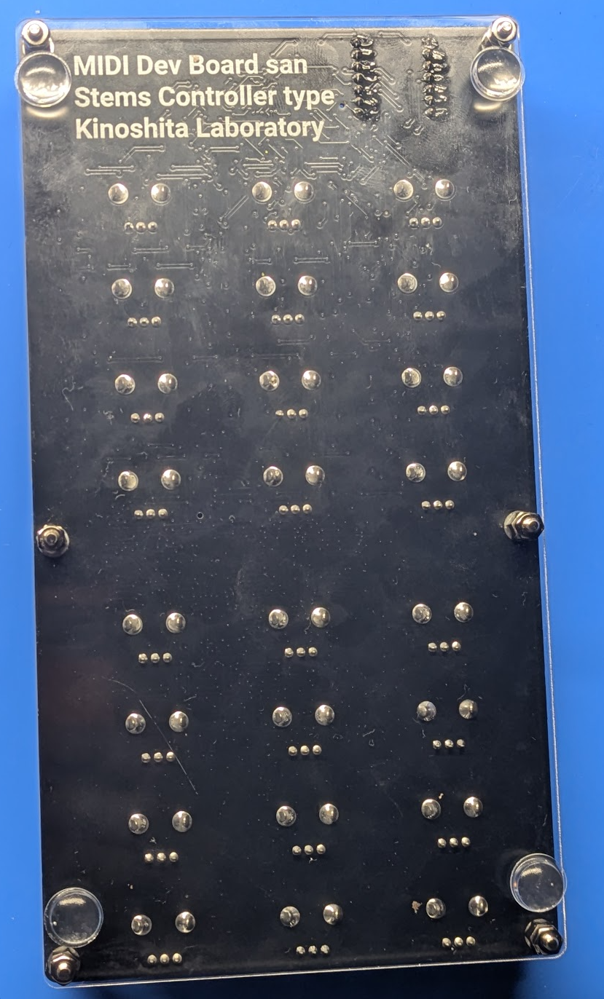

Place knob caps:

Place tactile switch caps:

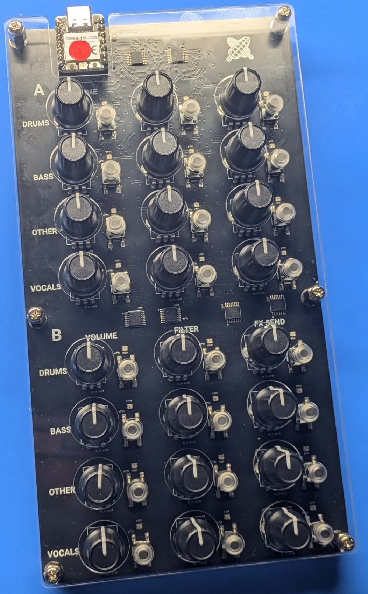

## Usage

- Connect the product to PC/MAC.
- Import .tsi file below on Traktor.

<https://github.com/kinoshita-lab/StemsMIDI/tree/main/Traktor%20Setting>
